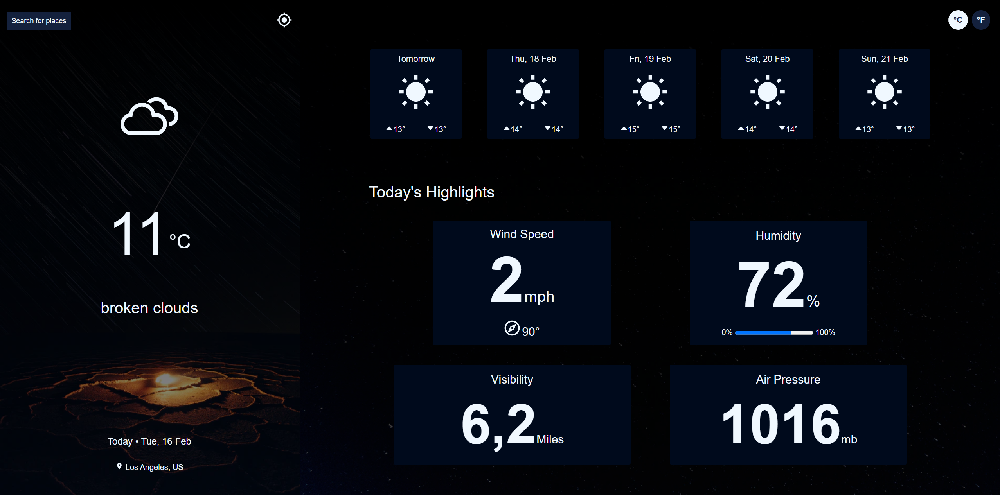
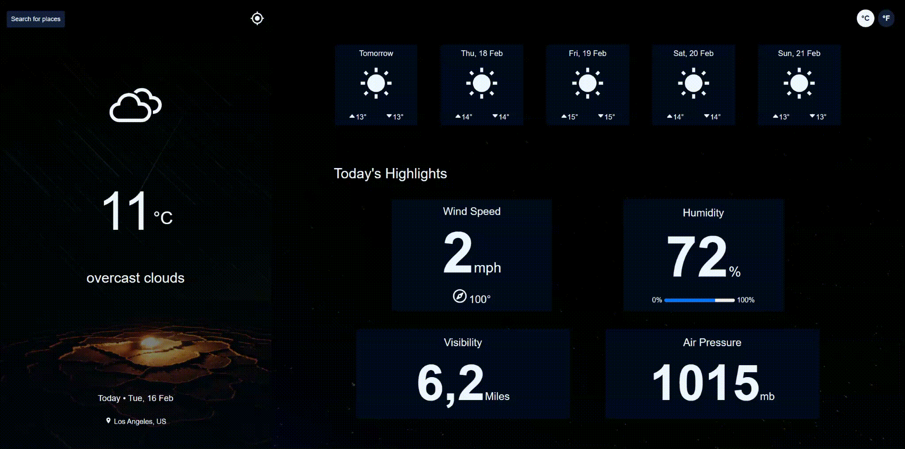

# Daily Weather

Daily Weather is a weather application that I built to practice react state management working with APIs.

This application was also a perfect way to practice new React concepts that I'd learnt such as custom hooks and useRef. I made multiple API calls and utilized the OpenWeatherMap API to get the weather data based on the city which I also obtained via a lookup API.

## Tech Stack

For this project I used:

- React
- Styled-Components

## Project Pupose and Goal

My main goal for this project was to understand some of React's advanced concepts. I created this project after taking the React State Management course by Cory House via Pluralsight.

This project was perfect for me to use the newly found concepts I'd learnt in the course.

I also wanted the app to be visually appealing and mobile responsive. To achieve this I decided to give styled-components a shot. It was fairly easy to get started with but I'm sure there's alot of stuff I could've done better.

This project was also one of the projects listed under the Frontend path at [devchallenges.io](https://devchallenges.io)

## Challenges and Thought Process

The implementation of this kind of application in general is fairly easy. However this particular one  was a little bit more challenging because of what I wanted to achieve.

Here are the user stories I tried to achieve:

- User can see weather data for their location by default
- User can search for weather data of a differnet city
- User can see weather information for the next 5 days
- User can see the date today and their location on the app
- User can see the dates for the forecast over the next 5 days
- User can see Icon corresponding to weather condition
- User can see wind speed and direction
- User can see air pressure, humidity and visibility
- User can see min and max degreee for the next 5 days
- User can convert temperature in Celcius to Faregnheight and vice versa
- User can request data for current location

Most of the above user stories were fairly easy to implement once the weather data was available.

However, some the data was unrelated and thus required making multiple API calls. For example I needed to make an API all to fetch the data for the curent weather info where as I needed to make a different API call to get the weather forecast.

Different components also needed related data which prompted me to lift state. This quickly became an ineffective solution because some components were receiving data that they did not need but the alternatives were overboard for such a project so I kept that implementation.

I also needed to populate the list of cities as the user typed letters pertaining to the city of interest. This required me to have the list of cities before hand so the user could see diferent options as they searched for the desired location.

The most challenging part of this project was of course making the API calls and managing them.

If you have any critism over what I did or what I could've done better please let me know.

## Future Improvements

In the future I will refactor the application to use a remote state management library like react-query to handle the API calls.

## Live Site

You can see the live version of the application [here](https://dailyweather.netlify.app)

## Preview

